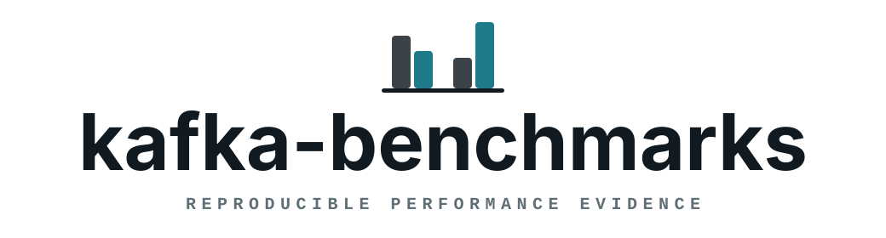

<p align="center">
  
</p>

<p align="center">
  <strong>Reproducible performance evidence for kafkars and other Apache Kafka clients.</strong>
</p>

<p align="center">
  A benchmark run here is not a number. It is a sealed, checksummed bundle that
  records the exact experiment, the exact environment, what every client
  actually did, and whether an independent verifier agrees the data survived.
</p>

<p align="center">
  <a href="https://github.com/zsumz/kafka-benchmarks/actions/workflows/ci.yml"></a>
</p>

<p align="center">
  <a href="#what-it-is">What it is</a>
  <span> · </span>
  <a href="#layout">Layout</a>
  <span> · </span>
  <a href="#the-engine">Engine</a>
  <span> · </span>
  <a href="#ci-and-the-nightly">CI</a>
  <span> · </span>
  <a href="#evidence">Evidence</a>
  <span> · </span>
  <a href="#scenarios-and-packs">Scenarios</a>
  <span> · </span>
  <a href="#quickstart">Quickstart</a>
  <span> · </span>
  <a href="#boundaries">Boundaries</a>
  <span> · </span>
  <a href="#status">Status</a>
</p>

<br />

## What it is

kafka-benchmarks answers one question for every change worth arguing about: did
it improve the client, against which baseline, and how do we know?

The design follows from taking that question literally.

- **Subjects are processes, not libraries.** Every client under measurement runs
  as its own operating-system process behind a small adapter protocol. Two
  clients linked into one binary share an allocator, a thread scheduler, and a
  page cache, and a harness that links its subjects ends up measuring itself.
  The process boundary is also what lets a client written in another language be
  compared at all.
- **Nobody grades their own homework.** An adapter reports what it believes it
  produced. A separate verifier reads the topic back and reports what the broker
  retained. Cross-client validity is decided from the verifier's report.
- **Every attempt seals.** Crashes, timeouts, and interrupts produce a sealed
  bundle recording exactly that. The runs worth studying most are the ones that
  went wrong, and a harness that only writes evidence on success is a harness
  that quietly deletes its own bad news.
- **Evidence is versioned and immutable.** Schemas are append-only: a new field
  or a new schema id, never a changed meaning under an old id. A sealed bundle
  carries two identities — one for the intent that was run, one for the bytes
  that resulted — so a bundle can be re-verified long after the machine that
  produced it is gone.
- **Validity is a separate axis from success.** A run can complete cleanly and
  still be too noisy, too short, or too unverified to support a claim. Those are
  different fields, and the harness never collapses them into one.

## Layout

```txt
crates/bench-schema      evidence documents, canonical JSON, identities
crates/benchctl          control plane: resolve/run/suite/capacity/report/packet
crates/bench-adapter-librdkafka   adapter-protocol shim for the C reference
crates/bench-verifier    typed views over independent read-back evidence
crates/bench-report      descriptive statistics over sealed bundles

adapters/                subject adapters; standalone workspaces, not members
legacy/benchctl/         the Node harness this repository was extracted from
scenarios/producer/headline/   the headline producer set (TOML)
scenarios/packs/         which scenarios belong to which cadence
schemas/                 one JSON Schema document per schema id
conformance/             committed payload, schedule, and histogram vectors
clusters/                local broker topologies for development runs
scripts/                 the gate and the harness entry points
docs/                    the performance contract, harness design, and roadmap
```

The adapters are deliberately not workspace members. A subject must be built
against its own pinned dependency graph, not against whatever this workspace
happens to resolve.

## The engine

`benchctl` is the control plane. It resolves a scenario into an experiment,
spawns every subject, supervises them against declared deadlines, invokes the
verifier, and seals a bundle — on every path out, including the ones that
failed.

Three inputs are separate files on purpose: a scenario is reviewed and stable, a
subject list says which binaries exist on this machine today, and a cluster
profile says where the brokers are and which tools reach them. The subject list
and the profile are per-machine and are not committed;
`scripts/generate-subject-config <dir> <bootstrap>` writes a working pair, and
`scripts/bench-m0-acceptance` writes its own under `target/m0-acceptance`.

Every example below is one command against those inputs. Build the binary and
set the two variables first:

```sh
cargo build --release --locked -p benchctl
export PATH="$PWD/target/release:$PATH"

bootstrap=127.0.0.1:39092,127.0.0.1:39093,127.0.0.1:39094
inputs=target/quickstart
scripts/generate-subject-config "$inputs" "$bootstrap"
```

**`resolve`** prints the resolved experiment and its `experiment_id` without
touching the cluster. It is how you ask what would run, and under what identity,
before spending a cluster on it.

```sh
benchctl resolve \
  --experiment scenarios/producer/headline/balanced-1k-12p.toml \
  --subjects "$inputs/subjects.toml" \
  --cluster "$inputs/cluster.toml" \
  --bootstrap "$bootstrap"
```

**`run`** is one attempt: every subject, in the subject list's order or the one
`--order` gives, ending in exactly one sealed bundle under
`results/<experiment-id>/<attempt-id>/`. A subject that fails records its
failure and the others still run, because "A crashed and B did not" is evidence.

```sh
benchctl run \
  --experiment scenarios/producer/headline/payload-16k-12p.toml \
  --subjects "$inputs/subjects.toml" \
  --cluster "$inputs/cluster.toml" \
  --bootstrap "$bootstrap" \
  --results results
```

**`suite`** repeats one scenario as paired blocks, alternating which subject
goes first, so that a drift in the machine falls on both subjects rather than on
the one that always ran second.

```sh
benchctl suite \
  --experiment scenarios/producer/headline/balanced-1k-12p.toml \
  --subjects "$inputs/subjects.toml" \
  --cluster "$inputs/cluster.toml" \
  --bootstrap "$bootstrap" \
  --repetitions 5
```

**`capacity`** runs the scheduled open-loop search: it raises the offered rate
until a declared objective breaks, then refines the bracket. Reaching the
ceiling without a failure is reported as inconclusive rather than as a capacity
nobody observed.

```sh
benchctl capacity \
  --experiment scenarios/producer/headline/capacity-balanced-1k-12p.toml \
  --subjects "$inputs/subjects.toml" \
  --cluster "$inputs/cluster.toml" \
  --bootstrap "$bootstrap"
```

**`pack`** runs every entry of one reviewed manifest, in the order it states.
It takes no `--experiment` — the manifest names the scenarios — and dispatches
each entry to the verb its repetition count implies: two or more is a `suite`,
one is a `run`, and one over a scenario carrying a `[search]` section is a
`capacity` ladder. It contributes no statistic of its own, so the evidence it
leaves is exactly what typing those verbs by hand would have left.

```sh
benchctl pack \
  --manifest scenarios/packs/nightly.toml \
  --subjects "$inputs/subjects.toml" \
  --cluster "$inputs/cluster.toml" \
  --bootstrap "$bootstrap"
```

**`report`** reads one sealed bundle and renders it. `suite` and `capacity`
write their own reports as they go; this is how you read a single attempt after
the fact. It reaches no broker and rewrites no bundle, so a reporting bug cannot
move a measurement.

A bundle is `results/<experiment-id>/<attempt-id>/`, so the most recent one is
whichever directory holds the newest `status.json`:

```sh
bundle=$(dirname "$(ls -t results/*/*/status.json | head -n 1)")

benchctl report --bundle "$bundle" --out reports/attempt.md
```

**`packet`** checks prose against the analysis packet a suite derived, and is
the only thing that makes a model-written summary evidence. It exits 0 when the
summary's verdict is the packet's and every citation resolves, and 65 when it is
not — see [CI and the nightly](#ci-and-the-nightly) below.

```sh
suite_dir=$(dirname "$(ls -t reports/*/*-suite/suite-summary.json | head -n 1)")

benchctl packet \
  --suite "$suite_dir/suite-summary.json" \
  --llm-summary "$suite_dir/llm-summary.json"
```

The `llm-summary.json` is what `scripts/benchmark-openai-summary` writes; a
suite that was never narrated has a packet and no summary to check against it.

## CI and the nightly

`.github/workflows/ci.yml` proves the harness is correct, buildable, and
deterministic on every pull request. No job in it measures performance: hosted
runners are shared and throttled, and a number produced on one is not evidence
about a client. Branch protection requires exactly one check, `quality-gate`.

`.github/workflows/nightly.yml` runs `benchctl pack` over
`scenarios/packs/nightly.toml` against the dev compose cluster at 08:00 UTC,
uploads the sealed `results/` and `reports/` trees for 30 days, and then asks a
model to narrate each suite's analysis packet with
`scripts/benchmark-openai-summary` — reading `OPENAI_API_KEY` from repository
secrets and `OPENAI_MODEL` / `OPENAI_REASONING_EFFORT` from repository variables
(defaulting to `gpt-5.5` and `high`), skipping the narration with a printed line
when the key is unset. Its numbers are shared-runner diagnostics and are never a
comparison between clients; what it proves is that the whole path still runs.

The summary is prose over the packet and nothing else — the model never sees an
evidence bundle — and it is only rendered once `benchctl packet` has bound it to
that packet. A rejected summary is reported in the run summary and does **not**
fail the workflow: narration is commentary on evidence, and may never be the
reason evidence is discarded. `scripts/benchmark-openai-summary-test` proves the
request contract offline, with no network and no key, on every pull request.

## Evidence

The measurement document is `kafkars.producer-benchmark.v2`. Every offer owns
one immutable identity and four timestamps — intended, call start, accepted,
terminal — and none of them is ever reset because a queue was full, so the time
a record spent being pushed back on is part of every latency the document
reports. Offers that never crossed the client API are counted as offered but not
accepted, which is what stops an overload from being spent as throughput.
Distributions are carried as bounded log-linear histograms whose bytes the Rust
and C adapters must produce identically, so evidence memory does not scale with
run length and percentiles are derived by the reader rather than chosen by the
writer. The full document set, the accounting invariants, and what a reader may
conclude from each field are in [`docs/EVIDENCE.md`](./docs/EVIDENCE.md).

## Scenarios and packs

`scenarios/producer/headline/` is the predeclared headline set: a 128-byte
latency floor, the balanced 1 KiB default, a 96-partition fanout point, a 16 KiB
payload point, a deliberate overload with a declared SLO, and a balanced
capacity search. Each file opens with the question it exists to answer.

The 256 KiB and 900 KB payload points are not in that set. They moved to
`scenarios/producer/deferred/` because the client under test declines records
that large today; `scenarios/DEFERRED.md` names the specific limit.

`scenarios/packs/` says which of those belong to which cadence — `pr.toml` is
one balanced attempt, `nightly.toml` is the whole set at three repetitions plus
one capacity search. A pack is a reviewed manifest of scenario paths and
repetition counts, and `benchctl pack` is what runs one.

Workloads from the design document's matrix that cannot run yet are listed, with
the specific thing that refuses each one, in
[`scenarios/DEFERRED.md`](./scenarios/DEFERRED.md).

## Quickstart

```sh
git clone https://github.com/zsumz/kafka-benchmarks && cd kafka-benchmarks
scripts/check
```

That is the single gate, and it runs on a clean clone with nothing beside it. It
formats, lints, tests, and documents the Rust workspace, checks the schema
registry against `schemas/`, asserts the librdkafka pin reads the same in every
place it is written down, runs the legacy control-plane tests and the offline
model-summary contract, and reports on sibling-checkout provenance.

Provenance is the one lane that behaves differently on a bare clone: the sibling
checkouts it attests are `kafka-client`, `kafka-driver`, and `kafka-protocol`
next to this directory, and when they are absent it says so as an advisory and
exits 0. That is deliberate — no crate in this workspace depends on them.

What needs the siblings is anything that builds or runs a real subject:

| Command | Needs |
| --- | --- |
| `scripts/check` | nothing but the pinned Rust and Node toolchains |
| `scripts/check-benchmarks` | the three sibling checkouts, plus a bootstrapped librdkafka |
| `scripts/bench-m0-acceptance`, `scripts/bench-suite-acceptance` | the above, plus a running broker |
| `KAFKA_BENCH_PROVENANCE=strict scripts/check-dependency-provenance` | the siblings, on their pinned revisions and clean |

The acceptance scripts check for a broker first and exit 69 without touching
anything if none is listening, so running one on a laptop with no cluster costs
a second and prints the compose command that would start one. Both write their
generated inputs and evidence under `target/` — `target/m0-acceptance` and
`target/suite-acceptance` — and honour `CARGO_TARGET_DIR`.

```sh
docker compose -f clusters/dev-compose/compose.yml up -d --wait
scripts/bench-m0-acceptance
```

The full procedure, the experiment format, and the meaning of every document in
a sealed bundle live in [`docs/BENCHMARK_HARNESS_DESIGN.md`](./docs/BENCHMARK_HARNESS_DESIGN.md);
what a result is allowed to claim lives in
[`docs/PERFORMANCE_CONTRACT.md`](./docs/PERFORMANCE_CONTRACT.md).

## Boundaries

kafka-benchmarks is not:

- **a leaderboard.** It produces evidence for a specific experiment on specific
  hardware. Ranking clients in general is not something a benchmark can do, and
  publishing a table that implies otherwise is the failure mode this repository
  exists to avoid.
- **a microbenchmark suite for private internals.** Adapters depend only on
  shipped public client surfaces. If a measurement requires reaching inside a
  client, it belongs in that client's repository, not here.
- **a claim generator from developer-host numbers.** The headline scenarios are
  sized to run on a laptop against containers sharing that laptop. Numbers taken
  there are diagnostic: useful for spotting a regression while working, never
  evidence for a public statement about performance. Every scenario in this
  repository declares `claim_eligible = false`, and the resolver refuses any
  that does not.
- **a Kafka client.** Nothing here implements the protocol. The subjects do.

## Status

Pre-0.1 and moving. The current milestone is a measurement-correct v2 engine:
the four-timestamp offer model, bounded histograms in place of run-sized arrays,
`suite` and `capacity` in Rust rather than only in the legacy Node plane,
reports over sealed bundles, and a headline scenario pack that says what each of
its workloads is for.

The harness was extracted from the private `zsumz/kafka-client-private`
repository, where it had grown into a hard-coded two-subject script; this
repository is the generalization of that work into a lab that can measure any
client behind the adapter protocol.

Two things this milestone deliberately did not build: a protocol-aware loopback
lane, and the client-internal request and batch counters the performance
contract asks for — the second because reading them would mean changing the
client, which is out of bounds here. Both, with the rest of the loop's
deferrals, are in [`docs/ROADMAP.md`](./docs/ROADMAP.md).

Nothing is published. No crate from this workspace goes to a registry, and the
artifact this repository produces is a sealed evidence bundle, not a release.

Every bundle sealed today records `claim_eligible: false`. That is deliberate,
not an oversight: the checks that would justify a public performance claim —
sufficient paired repetitions, a dedicated cluster, provenance strict enough to
name what was running — are recorded as deferred rather than quietly assumed.

## Project

[Changelog](./CHANGELOG.md) · [Contributing](./CONTRIBUTING.md) ·
[Security](./SECURITY.md) · [Releasing](./RELEASING.md)

## License

Licensed under Apache-2.0. See [LICENSE](./LICENSE) and [NOTICE](./NOTICE).

Apache Kafka is a trademark of the Apache Software Foundation. This project is
independent and is not endorsed by the Apache Software Foundation.
