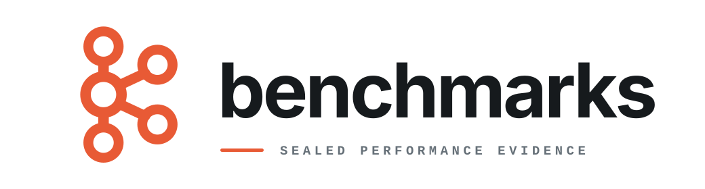

<p align="center">
  
</p>

<p align="center">
  <a href="https://github.com/kafkars/benchmarks/actions/workflows/ci.yml"></a>
</p>

<p align="center">
  <a href="#why">Why</a>
  <span> · </span>
  <a href="#verify">Verify</a>
  <span> · </span>
  <a href="#run">Run</a>
  <span> · </span>
  <a href="#read-the-results">Results</a>
  <span> · </span>
  <a href="#documentation">Docs</a>
</p>

`kafka-benchmarks` compares Apache Kafka clients and produces sealed,
checksummed evidence. It currently focuses on the public
[Kafkars](https://github.com/kafkars/kafkars) producer against raw librdkafka.

## Why

A benchmark here is more than a timing:

- Clients run as isolated processes.
- An independent verifier checks what reached Kafka.
- Crashes, timeouts, and interrupts still seal evidence.
- Results include validity, repetition, noise, and provenance.
- Sealed bundles are immutable.

## Verify

```sh
git clone https://github.com/kafkars/benchmarks
cd benchmarks
cargo +1.96.0 install zcheck --version 0.0.2 --locked
cargo +1.96.0 install zrail --version 0.0.1 --locked
zcheck
```

`zcheck` is the review gate. It records one receipt across formatting, linting,
tests, docs, schemas, zrail policy, detached-adapter policy, legacy tests, and
provenance checks. No Kafka cluster or sibling checkout is required.

## Run

Real-client runs need Docker and these sibling checkouts beside this repository.
The scripts build the pinned librdkafka release on first use.

```txt
kafkars/
kafka-driver/
kafka-protocol/   # the kafkars/kafka-wire repository
```

Start the local three-broker cluster and run five paired attempts:

```sh
docker compose -f clusters/dev-compose/compose.yml up -d --wait

bootstrap=127.0.0.1:39092,127.0.0.1:39093,127.0.0.1:39094
scripts/bench-suite-acceptance "$bootstrap" 5
```

The script builds both adapters, generates machine-local configuration, runs
the suite, verifies every bundle, and prints the report directory. Output stays
under `target/suite-acceptance/`.

For one attempt:

```sh
scripts/bench-m0-acceptance
```

## Read the results

Suite reports lead with the conclusion:

| Section | Meaning |
| --- | --- |
| Result | paired ratios, confidence intervals, and favorable/worse/unresolved outcomes |
| Scorecard | each client's median goodput, latency, CPU, and memory |
| Checks | whether the evidence and comparison rules passed |
| Run stability | how much subjects and ratios varied |
| Request economics | requests, batches, retries, timeouts, and wire efficiency |

Every report states whether it may support a public claim. All current
scenarios set `claim_eligible = false`; laptop and shared-runner numbers are
diagnostic only.

## Commands

| Command | Purpose |
| --- | --- |
| `benchctl resolve` | show the exact experiment without touching Kafka |
| `benchctl run` | run one attempt and print its sealed bundle |
| `benchctl suite` | run paired, alternating repetitions |
| `benchctl capacity` | search an offered rate against declared objectives |
| `benchctl pack` | run a reviewed scenario manifest |
| `benchctl report` | render one sealed attempt |
| `benchctl packet` | verify generated prose against an analysis packet |

## Repository

| Path | Purpose |
| --- | --- |
| `crates/` | schemas, control plane, verification, reporting, and the C shim |
| `adapters/` | standalone subject adapters |
| `scenarios/` | workloads and cadence packs |
| `schemas/` and `conformance/` | versioned contracts and byte-exact vectors |
| `docs/` | design, evidence semantics, boundaries, and roadmap |
| `scripts/` | qualification tasks and benchmark entry points |

## Documentation

- [Performance contract](./docs/PERFORMANCE_CONTRACT.md)
- [Evidence format](./docs/EVIDENCE.md)
- [Architecture](./ARCHITECTURE.md)
- [Harness design](./docs/BENCHMARK_HARNESS_DESIGN.md)
- [Roadmap](./docs/ROADMAP.md)
- [Deferred scenarios](./scenarios/DEFERRED.md)
- [Zrail gaps](./docs/ZRAIL_GAPS.md)

## Boundaries

This repository is not a leaderboard, a Kafka client, or a benchmark of private
internals. Results describe one experiment on one environment. Adapters use
shipped public client APIs and never decide their own validity.

## Status

Pre-0.1. The v2 engine supports paired suites, capacity search, bounded
histograms, four-timestamp latency accounting, sealed reports, and exact public
Kafkars request and batch counters. Nothing is published.

## Project

[Changelog](./CHANGELOG.md) · [Contributing](./CONTRIBUTING.md) ·
[Security](./SECURITY.md) · [Releasing](./RELEASING.md)

## License

Apache-2.0. See [LICENSE](./LICENSE) and [NOTICE](./NOTICE).

Apache Kafka is a trademark of the Apache Software Foundation. This project is
independent and is not endorsed by the Apache Software Foundation.
